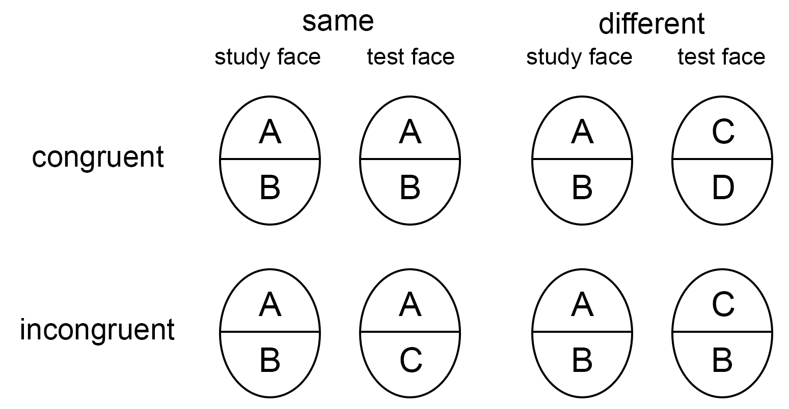

<style>
pre {
  overflow-x: auto;
}
pre code {
  word-wrap: normal;
  white-space: pre;
}
</style>

# Preparations

```{r setup, include=FALSE}
## load libraries
library(knitr)
library(tidyverse)
library(afex)
library(emmeans)
library(vcd)
library(ggpubr)

theme_set(papaja::theme_apa())

# set global chunk options, put figures into folder
knitr::opts_chunk$set(
  echo = TRUE, warning = FALSE, message = FALSE, 
  include = TRUE, tidy = FALSE, archive = FALSE,
  size = "big", fig.width=8, fig.asp=0.7, 
  width = 1800,
  emmeans=list(msg.interaction=FALSE))

source(here::here("R", "funcs.R"))
source(here::here("R", "func_kappa.R"))
set.seed(2022)
```

```{r}
two_colors <- c("#D55E00", "#56B4E9")
custom_clr <- c("#7F7F7F", "#E64B35", "#56B4E9", "#DF8F44", "#008B45", "#925E9F", "#000000")
```


## Read data

```{r}
# article ID and journal
df_publ <- readxl::read_excel(here::here("data", "CodingSheet_anova.xlsx"),
                              sheet="PaperMeta",
                              range="A1:G750") %>%
  transmute(`Paper ID`, journal = `Publication Title`) %>% 
  mutate(journal = factor(journal),
         journal = fct_recode(journal,
                              JEPG="Journal of Experimental Psychology: General",
                              `Psych Sci`="Psychological Science",
                              `J Abn Psych`="Journal of Abnormal Psychology",
                              JCCP="Journal of Consulting and Clinical Psychology",
                              JESP="Journal of Experimental Social Psychology",
                              JPSP="Journal of Personality and Social Psychology"),
         journal = fct_relevel(journal, "JEPG", "Psych Sci", "J Abn Psych", "JCCP", "JESP", "JPSP")) 

# "Title_Prescreening" Sheet
df_prescreen <- readxl::read_excel(here::here("data", "CodingSheet_anova.xlsx"),
                                   sheet="Title_Prescreening",
                                   range="A1:C750") %>%
  left_join(df_publ, by="Paper ID") %>%
  select(-Title)

# "ResearchPaper" Sheet
df_mainscreen <- readxl::read_excel(here::here("data", "CodingSheet_anova.xlsx"),
                               sheet="ResearchPaper",
                               range="A1:L750") %>%
  left_join(df_publ, by="Paper ID") %>%
  select(-Title)
```

```{r}
# read the coding sheet for the first round by YJ
# df_conv_YJ1 <- readxl::read_excel(here::here("data", "CodingSheet_pilot.xlsx"), 
#                                  sheet="AnalysisInfo_YJ",
#                                  range="A1:AO39") %>% 
#   select(-Title) 
# 
# # read the coding sheet for the first round by HJ
# df_conv_HJ1 <- readxl::read_excel(here::here("data", "CodingSheet_pilot.xlsx"), 
#                                  sheet="AnalysisInfo_HJ",
#                                  range="A1:AO39") %>% 
#   select(-Title) 
```


```{r}
# # read the coding sheet for the first round (after resolving inconsistency)
# df_conv_1 <- readxl::read_excel(here::here("data", "CodingSheet_pilot.xlsx"), 
#                                  sheet="AnalysisInfo_1st",
#                                  range="A1:AO39") %>% 
#   select(-Title) 
# # read the coding sheet for the second round by YJ
# df_conv_YJ2 <- readxl::read_excel(here::here("data", "CodingSheet_pilot.xlsx"), 
#                                  sheet="AnalysisInfo_2nd_YJ",
#                                  range="A1:AO39") %>% 
#   select(-Title) 
# # read the coding sheet for the second round by YJ
# df_conv_HJ2 <- readxl::read_excel(here::here("data", "CodingSheet_pilot.xlsx"), 
#                                  sheet="AnalysisInfo_2nd_YJ",
#                                  range="A1:AO39") %>% 
#   select(-Title) 
# 
# df_conv <- bind_rows(df_conv_1, df_conv_YJ2, df_conv_HJ2) %>% 
#   left_join(df_publ, by="Paper ID")

# df_conv <- readxl::read_excel(here::here("data", "CodingSheet_pilot.xlsx"), 
#                                  sheet="AnalysisInfo_HJ",
#                                  range="A1:AO39") %>% 
#   left_join(df_publ, by="Paper ID") %>% 
#   select(-Title) 
```


# Intra-rater consistency
Estimate the intra-rater consistency for the information on whether the study employed ANOVA, experimental designs and the ANOVA prevalence inspected by Y.J. and H.J. separately.

## Research article and ANOVA

```{r}
# # whether it is a research article (unweighted)
df_res_K <- df_mainscreen %>%
  select(`Research article_YJ`, `Research article_HJ`) %>%
  group_by(`Research article_YJ`, `Research article_HJ`) %>%
  summarize(count = n(), .groups = "drop") %>%
  pivot_wider(names_from=`Research article_HJ`, values_from = count, values_fill = 0)

Ka_res <- df_res_K %>%
  select(-`Research article_YJ`) %>%
  as.matrix() %>%
  Kappa()

print(Ka_res, CI=TRUE) # Kappa for research articles
```

```{r}
# whether ANOVA was used (unweighted)
df_aov_K <- df_mainscreen %>% 
  filter(`Research article`==1) %>% # only among research articles
  select(`Use ANOVA_YJ`, `Use ANOVA_HJ`) %>% 
  group_by(`Use ANOVA_YJ`, `Use ANOVA_HJ`) %>% 
  summarize(count=n(), .groups="drop") %>% 
  pivot_wider(names_from=`Use ANOVA_HJ`, values_from = count, values_fill = 0) 

Ka_aov <- df_aov_K %>% 
  select(-`Use ANOVA_YJ`) %>% 
  as.matrix() %>% 
  Kappa()

print(Ka_aov, CI=TRUE) # Kappa for using ANOVA
```


## The first 120 articles

```{r}
# experimental designs
# design_list <- c("N_factor", "max_No_levels")
# 
# kappa_0 <- lapply(design_list, thekappa, df1=df_conv_YJ1, df2=df_conv_HJ1, isweighted=TRUE) %>% 
#   bind_rows()
```

```{r}
# Convention A
# con_a_list <- c("a1_report_all", "a3_correction")
# 
# kappa_a <- lapply(con_a_list, thekappa, 
#                   df1=filter(df_conv_YJ1, a2_multiway==1), 
#                   df2=filter(df_conv_HJ1, a2_multiway==1)) %>% 
#   bind_rows()
```

```{r}
# Convention B
# con_b_wlist <- c("b1_N_factor3+", "b2_N_significant_b1")
# con_b_ulist <- c("b7_posthoc", "b8_correction")
# 
# kappa_bw <- lapply(con_b_wlist, thekappa, isweighted=TRUE,
#                    df1=filter(df_conv_YJ1, max_No_levels>2), 
#                    df2=filter(df_conv_HJ1, max_No_levels>2)) %>% 
#   bind_rows()
# 
# kappa_bu <- lapply(con_b_ulist, thekappa, 
#                    df1=filter(df_conv_YJ1, max_No_levels>2), 
#                    df2=filter(df_conv_HJ1, max_No_levels>2)) %>% 
#   bind_rows()
# kappa_b <- bind_rows(kappa_bw, kappa_bu)
```

```{r}
# Convention C
# con_c_wlist <- c("c1_N_2way_inter", "c2_N_sig_in_c1")
# con_c_ulist <- c("c7_simple_effect", "c8_correction")
# 
# kappa_cw <- lapply(con_c_wlist, thekappa, isweighted=TRUE,
#                    df1=filter(df_conv_YJ1, N_factor>1), 
#                    df2=filter(df_conv_HJ1, N_factor>1)) %>% 
#   bind_rows()
# 
# kappa_cu <- lapply(con_c_ulist, thekappa, 
#                    df1=filter(df_conv_YJ1, N_factor>1), 
#                    df2=filter(df_conv_HJ1, N_factor>1)) %>% 
#   bind_rows()
# kappa_c <- bind_rows(kappa_cw, kappa_cu)
```

```{r}
# Convention D & E
# kappa_d1e1 <- thekappa(df1=filter(df_conv_YJ1, N_factor>2), 
#                     df2=filter(df_conv_HJ1, N_factor>2),
#                     colname="d1_e1_highest_sig")
# # kappa_d <- thekappa(df1=filter(df_conv_YJ1, N_factor>2, d1_e1_highest_sig==1), 
# #                     df2=filter(df_conv_HJ1, N_factor>2, d1_e1_highest_sig==1),
# #                     colname="d1_separate")
# kappa_e <- thekappa(df1=filter(df_conv_YJ1, N_factor>2, d1_e1_highest_sig==0), 
#                     df2=filter(df_conv_HJ1, N_factor>2, d1_e1_highest_sig==0),
#                     colname="e1_combine")
# 
# # kappa_de <- bind_rows(kappa_d1e1, kappa_d, kappa_e)
# kappa_de <- bind_rows(kappa_d1e1, kappa_e)
```

```{r}
# (kappa_df <- bind_rows(kappa_0, kappa_a, kappa_b, kappa_c, kappa_de))
```

```{r}
# the mean consistency
# tibble(mean = mean(kappa_df$value),
#        min = min(kappa_df$value),
#        max = max(kappa_df$value)) 
```

# ANOVA prevalence

## Screening information

```{r}
# number of articles included at each stage
df_included_all <- df_mainscreen %>%  
  summarize(journal = "Overall",
            In1_all = n(),
            In2_title = sum(1-Title_Prescreening),
            In3_research = sum(`Research article`),
            In4_ANOVA = sum(`Use ANOVA`),
            In5_include = sum(Included))

# number of articles at different stages
df_included <- df_mainscreen %>% 
  group_by(journal) %>% 
  summarize(In1_all = n(),
            In2_title = sum(1-Title_Prescreening),
            In3_research = sum(`Research article`),
            In4_ANOVA = sum(`Use ANOVA`),
            In5_include = sum(Included)) %>% 
  add_row(df_included_all, .before=1)
df_included
```

```{r}
# Percentage (relative to the total number of articles)
df_included %>% 
  transmute(journal, In1_all,
            In2_title = paste0(round((In2_title/In1_all)*100, 2), '%'),
            In3_research = paste0(round((In3_research/In1_all)*100, 2), '%'),
            In4_ANOVA = paste0(round((In4_ANOVA/In1_all)*100, 2), '%'),
            In5_include = paste0(round((In5_include/In1_all)*100, 2), '%'))
```


```{r}
# number of articles excluded at different stages
df_excluded <- df_mainscreen %>% 
  group_by(journal) %>% 
  summarize(Ex1_all = n(),
            Ex2_title = sum(Title_Prescreening),
            Ex3_research = sum(1-`Research article`),
            Ex4_ANOVA = sum(1-`Use ANOVA`),
            Ex5_exclude = sum(1-Included)) %>% 
  add_row( # add summary row
    summarize(df_mainscreen, 
              journal = "Overall",
              Ex1_all = n(),
              Ex2_title = sum(Title_Prescreening),
              Ex3_research = sum(1-`Research article`),
              Ex4_ANOVA = sum(1-`Use ANOVA`),
              Ex5_exclude = sum(1-Included)),
    .before=1)
df_excluded
```

## ANOVA prevalence
```{r}
# The percentage of articles employing ANOVA among all research articles:  
df_included %>% 
  mutate(prevalence_anova = round(In4_ANOVA/In3_research*100, 2))
```

## ANOVA complexity

```{r}
# df_complex <- df_conv %>% 
#   filter(included==1) %>% 
#   transmute(`Paper ID`, N_factor, max_No_levels, Design,
#             Design_int = str_split(Design, "_"),
#             Avg_No_levels = sapply(Design_int, function(x){mean(as.numeric(x))}),
#             Complexity = sapply(Design_int, function(x){prod(as.numeric(x))}),
#             journal)
```

Across ANOVAs:
```{r}
# df_complex %>% 
#   group_by(journal) %>% 
#   summarize(mean_N_factor = mean(N_factor),
#             mean_max_N_levels = mean(max_No_levels),
#             mean_complexity = mean(Complexity)) %>% 
#   add_row( # add summary row
#     summarize(df_complex, 
#               journal = "All",
#               mean_N_factor = mean(N_factor),
#               mean_max_N_levels = mean(max_No_levels),
#               mean_complexity = mean(Complexity))) 
```

```{r}
# plot_design <- df_complex %>% 
#   mutate(design_ = str_replace_all(Design, '_', '*')) %>% 
#   ggplot(aes(x = reorder(design_, Complexity))) +
#   geom_histogram(stat="count") +
#   labs(x = "Experimental designs")
# plot_design
```

alluvial figure (?) [left side is the experimental designs and the right side is the numbers of conditions.]
```{r}
# df_complex %>% 
#   select(Design, Complexity) %>% 
#   group_by(Design, Complexity) %>% 
#   summarize(count = n(), .groups="drop") 
```

## ANOVA convention prevalence

### Convention A: inspect all effects
```{r}
# df_conv_a <- df_conv %>% 
#   filter(a2_multiway==1) %>% 
#   select(`Paper ID`, starts_with("a"), journal)
# 
# # percentage of ANOVAs reporting/inspecting all effects among multi-way ANOVA
# df_conv_a_all <- summarize(df_conv_a, 
#                            journal = "All",
#                            conA = mean(a1_report_all))
# 
# df_conv_a %>% 
#   group_by(journal) %>% 
#   summarize(conA = mean(a1_report_all)) %>% 
#   add_row(df_conv_a_all) # add summary row
```

```{r}
# df_conv_a_adjust <- df_conv_a %>% 
#   group_by(a3_correction) %>% 
#   summarize(journal = "All", count = n())
# 
# df_conv_a %>% 
#   group_by(journal, a3_correction) %>% 
#   summarize(count = n(), .groups="drop") %>% 
#   add_row(df_conv_a_adjust) 
```


### Convention B: post-hoc
```{r}
# df_conv_b <- df_conv %>% 
#   filter(max_No_levels>2) %>% 
#   select(`Paper ID`, max_No_levels, starts_with("b"), journal)
# 
# # percentage of (not) performing post-hoc analysis when the main effect is (not) significant
# df_conv_b_artile <- df_conv_b %>% 
#   mutate(isConB = b5_main_effect_sig == b7_posthoc) %>% 
#   group_by(`Paper ID`, journal) %>% 
#   summarize(meanB_art = mean(isConB), .groups="drop")
# 
# # show the result
# df_conv_b_all <- df_conv_b_artile %>% 
#   summarize(journal = "All", conB = mean(meanB_art))
# 
# df_conv_b_artile %>% 
#   group_by(journal) %>% 
#   summarize(conB = mean(meanB_art)) %>% 
#   add_row(df_conv_b_all) # add summary row
```

Multiple comparison corrections (per ANOVA)
```{r}
# df_conv_b_adjust <- df_conv_b %>% 
#   filter(b5_main_effect_sig == 1) %>% 
#   group_by(b8_correction) %>% 
#   summarize(journal = 'All', count = n())
#   
# df_conv_b %>% 
#   filter(b5_main_effect_sig == 1) %>% 
#   group_by(journal, b8_correction) %>% 
#   summarize(count = n(), .groups="drop") %>% 
#   add_row(df_conv_b_adjust) 
```


### Convention C: simple effect analysis
```{r}
# df_conv_c <- df_conv %>% 
#   filter(N_factor>1) %>% 
#   select(`Paper ID`, N_factor, starts_with("c") & !starts_with("Con"), journal)
# 
# # percentage of (not) performing simple analysis when the interaction is (not) significant
# df_conv_c_artile <- df_conv_c %>% 
#   mutate(isConC = c5_inter_sig == c7_simple_effect) %>% 
#   group_by(`Paper ID`, journal) %>% 
#   summarize(meanC_art = mean(isConC), .groups="drop")
# 
# # show the result
# df_conv_c_all <- df_conv_c_artile %>% 
#   summarize(journal = "All", conC = mean(meanC_art))
# 
# df_conv_c_artile %>% 
#   group_by(journal) %>% 
#   summarize(conC = mean(meanC_art)) %>% 
#   add_row(df_conv_c_all) # add summary row
```

Multiple comparison corrections (per ANOVA)
```{r}
# df_conv_c_adjust <- df_conv_c %>% 
#   filter(c5_inter_sig == 1) %>% 
#   group_by(c8_correction) %>% 
#   summarize(journal = 'All', count = n())
#   
# df_conv_c %>% 
#   filter(c5_inter_sig == 1) %>% 
#   group_by(journal, c8_correction) %>% 
#   summarize(count = n(), .groups="drop") %>% 
#   add_row(df_conv_c_adjust)
```

### Convention D: separate 

```{r}
# df_conv_de <- df_conv %>% 
#   filter(N_factor>2) %>% 
#   select(`Paper ID`, N_factor, d1_e1_highest_sig, d1_separate, e1_combine, journal)
# 
# # 
# df_conv_d_artile <- df_conv_de %>% 
#   filter(d1_e1_highest_sig == 1) %>% 
#   group_by(`Paper ID`, journal) %>% 
#   summarize(meanD_art = mean(d1_separate), .groups="drop")
# 
# # show the result
# df_conv_d_all <- df_conv_d_artile %>% 
#   summarize(journal = "All", conD = mean(meanD_art))
# 
# df_conv_d_artile %>% 
#   group_by(journal) %>% 
#   summarize(conD = mean(meanD_art)) %>% 
#   add_row(df_conv_d_all) # add summary row
```

### Convention E: combine 

```{r}
# # 
# df_conv_e_artile <- df_conv_de %>% 
#   filter(d1_e1_highest_sig == 0) %>% 
#   group_by(`Paper ID`, journal) %>% 
#   summarize(meanE_art = mean(e1_combine), .groups="drop")
# 
# # show the result
# df_conv_e_all <- df_conv_e_artile %>% 
#   summarize(journal = "All", conE = mean(meanE_art))
# 
# df_conv_e_artile %>% 
#   group_by(journal) %>% 
#   summarize(conE = mean(meanE_art)) %>% 
#   add_row(df_conv_e_all) # add summary row
```


# Simulating Type I error in ANOVA

```{r}
Nsim <- 10000 # number of simulation
alphas <- c(0.001, 0.005, 0.01, 0.05, (1:4)/10)  # 0.001 ~ 0.4
```

## ANOVA omnibus F-test

```{r}
p_omni <- sim_omnibus(N_subj = 30, iter = Nsim, n_core=16, 
                      file_cache = here::here("simulation", "p_omni.rds"),
                      N_IV = 2:5)
```

Type I error rates when not taking into account omnibus F-test:
```{r}
dfs_sig_omni <- sig_omnibus(p_omni, 0.05) 

df_wo_omni <- dfs_sig_omni %>% 
  select(-c(N_sig, p.value)) %>% 
  group_by(N_IV, effnames) %>% 
  summarize(TypeI = mean(sig), .groups = "drop") %>% 
  mutate(omni = FALSE)

df_wo_omni %>% 
  pivot_wider(names_from = effnames, values_from = TypeI)
```

Type I error rates when taking into account omnibus F-test:
```{r}
df_w_omni <- dfs_sig_omni %>% 
  select(-c(N_sig, p.value)) %>% 
  group_by(N_IV, effnames) %>% 
  summarize(TypeI = mean(sig_with_omni), .groups = "drop")  %>% 
  mutate(omni = TRUE)

df_w_omni %>% 
  pivot_wider(names_from = effnames, values_from = TypeI) 
```

```{r fig.width=8, fig.asp=0.6}
fig_simu_a <- bind_rows(df_wo_omni, df_w_omni) %>% 
  filter(effnames %in% c("A", "sig_any")) %>% 
  mutate(effnames = fct_recode(effnames, `A single effect` = "A", `FWER` = "sig_any"),
         omni = as_factor(omni),
         omni = fct_recode(omni, `Without omnibus F-test` = "FALSE", 
                           `With omnibus F-test`="TRUE")) %>% 
  ggplot(aes(x = N_IV, y = TypeI*100, fill = effnames, group = effnames)) +
  geom_col(position = "dodge") +
  facet_grid(~ omni, switch = "x") + 
  scale_fill_manual(values = custom_clr[2:3]) +
  geom_hline(yintercept = 5, linetype= "dashed", color="gray25") +
  scale_y_continuous(limits = c(0, 85), expand = c(0, 0)) +
  labs(x = "Number of factors in an ANOVA", y = "Type I Error Rate (%)", fill = "") +
  theme(legend.position = c(0.77, 0.55),
        axis.ticks.length = unit(.15, "cm"),
        strip.placement = "outside",
        axis.title.x = element_text(margin = margin(t = 0)))

# ggsave(file.path("images","simu_omnibus.png"), fig_simu_a, width = 8, height = 4.8)
fig_simu_a
```


## Main effect and post-hoc analysis
One-way ANOVA with four levels

```{r message=F}
# sim_main_posthoc is available in R/funcs.R
p_main_posthoc <- sim_main_posthoc(N_subj = 30, iter = Nsim, n_core=16, 
                                   file_cache = here::here("simulation", "p_main_posthoc.rds"),
                                   N_levels = c(3,4,5,6)) 
```

```{r}
df_TypeI_posthoc <- sig_main_posthoc(p_main_posthoc, 0.05) %>% 
  mutate(sig_anypost = N_sigpost > 0, # any of the pairwise comparison is significant
         sig_both_main_post = sig_main * sig_anypost) %>% # both the main and any of pairwise are significant
  group_by(N_level, alpha, adjust) %>% 
  summarize(TypeI_main = mean(sig_main),
            TypeI_both = mean(sig_both_main_post), 
            TypeI_postonly = mean(sig_anypost),
            .groups = "drop")

df_TypeI_posthoc
```


Claim significant results only when both the main effect and at least one of the post-hoc tests (with different multiple comparison corrections) are significant:
```{r}
df_TypeI_posthoc %>% 
  filter(adjust != "uncorrected") %>% # only when using multiple comparison correction
  select(-TypeI_postonly) %>% 
  pivot_wider(c(N_level, alpha), names_from=adjust, values_from=TypeI_both)
```

Claim significant results only when the main effect and at least one of the post-hoc tests (without different multiple comparison corrections) are significant:
```{r}
df_TypeI_posthoc %>% 
  filter(adjust == "uncorrected")  # only when NOT using multiple comparison correction
```

Claim significant results only when at least one of the post-hoc tests (with different multiple comparison corrections) are significant (regardless of the main effect results): 
```{r}
df_TypeI_posthoc %>% 
  filter(adjust != "uncorrected") %>% # only when using multiple comparison correction
  select(-TypeI_both) %>% 
  pivot_wider(c(N_level, alpha), names_from=adjust, values_from=TypeI_postonly)
```

```{r fig.width=8, fig.asp=0.7}
df_posthoc_tmp <- df_TypeI_posthoc %>% 
  filter(N_level == 4) %>% 
  pivot_longer(starts_with("TypeI_"), names_to = "effects", values_to = "TypeI") %>% 
  mutate(adjust = if_else(effects == "TypeI_main", "uncorrected", 
                          if_else(adjust == "uncorrected", "uncorrected", 
                                  str_to_title(as.character(adjust)))),
         adjust = fct_reorder(adjust, TypeI, mean, .desc=TRUE),
         adjust = fct_relevel(adjust, "uncorrected"),
         effects = factor(effects, 
                          levels = c("TypeI_main", "TypeI_postonly", "TypeI_both")),
         effects = fct_recode(effects, `Main effect\n` ="TypeI_main", 
                              `Post-hoc analysis\n(six pairwise comparisons)`="TypeI_postonly", 
                              `Conjunction Type I Error Rate (CER)\n(main effect & pairwise comparisons)`="TypeI_both")) %>% 
  distinct() 

fig_simu_b <- df_posthoc_tmp %>% 
  ggplot(aes(x=as.numeric(adjust), y = TypeI*100, fill=adjust)) + 
  geom_col(width=1) +   
  facet_grid(cols=vars(effects), scales="free_x", space="free_x", switch="x")+
  ggh4x::facetted_pos_scales(
    list(
      scale_x_continuous(breaks = 1, expand = c(0, 0.65)),
      scale_x_continuous(breaks = 3.5, expand = c(0, 0.65)),
      scale_x_continuous(breaks = 3.5, expand = c(0, 0.65))
    )) + 
  scale_fill_manual(values = custom_clr,
                    breaks = levels(df_posthoc_tmp$adjust)) + #,  
  geom_hline(yintercept = 5, linetype= "dashed", color="gray25") +
  scale_y_continuous(limits = c(0, 24), expand = c(0, 0)) +
  labs(y = "Type I Error Rate (%)", fill = "") +
  theme(legend.position = c(0.75, 0.6),
        axis.ticks.length = unit(.15, "cm"),
        axis.text.x = element_blank(),
        panel.spacing.x = unit(0, "pt"),
        strip.placement = "outside",
        axis.title.x = element_blank())
  
# ggsave(file.path("images","simu_mainpost.png"), width = 8, height = 5.6)
fig_simu_b
```


## Interaction and simple effect analysis

```{r}
p_inter_simple <- sim_inter_simple(N_subj = 30, iter = Nsim, n_core=16, 
                                   file_cache = here::here("simulation", "p_inter_simple.rds"))
```

Type I error rates for main effects and interaction (when different correction methods were applied to the simple effect analysis):
```{r}
p_inter_simple %>% 
  select(iter, adjust, p_mainA, p_mainB, p_inter) %>% 
  distinct() %>% 
  group_by(adjust) %>% 
  summarize(mean(p_mainA<0.05), mean(p_mainB<0.05), mean(p_inter<0.05)) 
```

Type I error rates (for different combinations of simple effects and interaction):
```{r}
df_TypeI_inter <- sig_inter_simple(p_inter_simple, 0.05) %>% 
  group_by(adjust, group) %>% 
  summarize(inter = mean(sig_inter),
            any_simple = mean(sig_any_simple),
            `inter&any` = mean(`sig_inter&any`),
            .groups="drop") %>% 
  pivot_longer(c(any_simple, `inter&any`), 
               names_to = "effects", values_to = "TypeI") %>% 
  mutate(effects = paste(effects, group, sep="_")) 


# Type I error rates
df_TypeI_inter %>% 
  select(-group) %>% 
  pivot_wider(names_from = effects, values_from = TypeI) %>% 
  select(adjust, inter, any_simple_byAB_4, `inter&any_byAB_4`, everything()) %>% 
  filter(adjust != "uncorrected") 
```

```{r}
df_TypeI_inter %>% 
  select(-group) %>% 
  pivot_wider(names_from = effects, values_from = TypeI) %>% 
  select(adjust, inter, any_simple_byAB_4, `inter&any_byAB_4`, everything()) %>% 
  filter(adjust == "uncorrected") 
```

```{r fig.width=10.5, fig.asp=0.35}
df_inter_simp_tmp <- df_TypeI_inter %>% 
  filter(group != "byB_2") %>% 
  select(-c(group, inter)) %>% 
  add_row(adjust="uncorrected", effects = "Interaction\n", 
          TypeI = unique(df_TypeI_inter$inter)) %>% 
  mutate(adjust = if_else(adjust == "uncorrected", "uncorrected",
                          str_to_title(as.character(adjust))),
         adjust = fct_reorder(adjust, TypeI, mean, .desc=TRUE),
         adjust = fct_relevel(adjust, "uncorrected"),
         effects = factor(effects, 
                          levels = c("Interaction\n", 
                                     "any_simple_byA_2", "any_simple_byAB_4",
                                     "inter&any_byA_2", "inter&any_byAB_4")),
         effects = fct_recode(effects, 
                              `Simple effect analysis\n(two pairwise comparisons)`= "any_simple_byA_2", 
                              `Simple effect analysis\n(four pairwise comparisons)`="any_simple_byAB_4",
                              `Conjunction Type I Error Rate\n(interaction & two comparisons)`="inter&any_byA_2",
                              `Conjunction Type I Error Rate\n(interaction & four comparisons)`= "inter&any_byAB_4"))

fig_simu_c <- df_inter_simp_tmp %>% 
  ggplot(aes(x=as.numeric(adjust), y = TypeI*100, fill=adjust)) + 
  geom_col(width=1) +   
  facet_grid(cols=vars(effects), scales="free_x", space="free_x", switch="x") +
  ggh4x::facetted_pos_scales(
    list(
      scale_x_continuous(breaks = 1, expand = c(0, 0.65)),
      scale_x_continuous(breaks = 3, expand = c(0, 0.65)),
      scale_x_continuous(breaks = 3, expand = c(0, 0.65)),
      scale_x_continuous(breaks = 3, expand = c(0, 0.65)),
      scale_x_continuous(breaks = 3, expand = c(0, 0.65))
    )) + 
  scale_fill_manual(values = custom_clr[c(1,3:6)],
                    breaks = levels(df_inter_simp_tmp$adjust)) + #,
  geom_hline(yintercept = 5, linetype= "dashed", color="gray25") +
  scale_y_continuous(limits = c(0, 18), expand = c(0, 0)) +
  labs(y = "Type I Error Rate (%)", fill = "") +
  theme(legend.position = c(0.86, 0.6),
        axis.ticks.length = unit(.15, "cm"),
        axis.text.x = element_blank(),
        panel.spacing.x = unit(0, "pt"),
        strip.placement = "outside",
        axis.title.x = element_blank())
  
# ggsave(file.path("images","simu_mainpost.png"), width = 8, height = 5.6)
fig_simu_c
```


# The complete composite face paradigm: repeated-measures ANOVA and hierarchical modeling

One of the popular paradigms measuring holistic face processing is the complete composite face task [@jinHolisticFaceProcessing; @Richler2014]. In this task, participants view two consecutive composite faces (created by combining top and bottom facial halves from different identities) and judge whether the two top halves are the same or different while ignore the bottom halves. There are mainly three independent variables in this paradigm: Congruency (*congruent* vs. *incongruent*), Alignment (*aligned* vs. *misaligned*), and Identity (*same* vs. *different*). Identity (*same* vs. *different*) refers to whether the two top (i.e., target) halves are the same or different (Figure \@ref(fig:ccf-design)). Alignment (*aligned* vs. *misaligned*) refers to whether the top and bottom facial halves are aligned or misaligned. Congruency (*congruent* vs. *incongruent*) refers to whether the situations of two top facial halves are the same as those of two bottom halves (Figure \@ref(fig:ccf-design)). Specifically, in *congruent* trials, when the two top facial halves are the same, the two bottom halves are also the same; when the two top facial halves are different, the bottom halves are different as well. Since in congruent trials, the situations are the same for both the top and bottom facial halves, the bottom halves are expected to facilitate the processing of top halves if participants could not ignore the bottom halves. By contrast, in *incongruent* trials, when the two top facial halves are different, the bottom halves are the same; when the two top halves are the same, the bottom halves are different. Thus, the bottom halves are expected to interfere with the processing of top halves if participants could not ignore the bottom halves. In other words, participants are expected to perform better in the *congruent* relative to *incongruent* trials (for aligned faces), which is also known as the Congruency effect [e.g., @Richler2011d]. Critically, this Congruency effect should be smaller for misaligned composite faces if the influence of bottom halves on the top halves mainly occurs for aligned (intact) faces, which is also known as the composite face effect [CFE; e.g., @Richler2011d]. One of the expected result patterns is displayed in Figure \@ref(fig:ccf-result). For this result pattern, we should observe a significant interaction between Congruency and Alignment if we perform a 2 (Congruency: *congruent* vs. *incongruent*) $\times$ 2 (Alignment: *aligned* vs. *misaligned*) repeated-measures ANOVA. This interaction is typically employed as the index of CFE [e.g., @jinHolisticFaceProcessing; @Richler2011d; @Ross2015]. However, a significant interaction between Congruency and Alignment does not guarantee the expected result pattern of CFE. As discussed in the main text, we also need to examine the Congruency effect in the aligned condition. Overall, we need to examine (1) whether the Congruency effect is larger than 0 in the aligned condition and (2) whether the Congruency effect in the aligned condition is larger than that in the misaligned condition. 

(ref:ccf-design-caption) Experimental designs of the complete composite face paradigm for aligned faces only. On each trial, participants are instructed to judge whether the top halves of the study and test faces are the same or not. The letters denote facial identities. *Same* and *different* refers to whether the two top facial halves are the same or different. Congruency (*congruent* vs. *incongruent*) refers to whether the situations of top facial halves are the same as those of bottom halves. In *congruent* trials, when the two top halves are the same, the bottom halves are also the same; when the two top halves are different, the bottom halves are also different. In *incongruent* trials, when the top halves are the same, the bottom halves are different; when the top facial halves are different, the bottom halves are the same.

```{r ccf-design, fig.width=5, fig.cap="(ref:ccf-design-caption)"}

```

(ref:ccf-result-caption) One expected result pattern for the complete composite face paradigm, i.e., the composite effect. The solid (red) and dashed (green) lines denote the *congruent* and *incongruent* conditions, respectively. The *same* and *different* trials are treated as "signal" and "noise" in the signal detection theory, and both of them are used to calculate sensitivity *d*' to describe the behavioral performance.

```{r ccf-result, fig.cap="(ref:ccf-result-caption)"}
tibble(Alignment = rep(c("aligned", "misaligned"), each=2),
       Congruency = rep(c("congruent", "incongruent"), 2),
       d = c(3.5, 2, 3, 2.9)) %>% 
  ggplot(aes(Alignment, d, color=Congruency, group=Congruency)) +
  geom_point(size=3, position=position_dodge(.1)) +
  geom_line(aes(linetype=Congruency), size=1) +
  ylim(c(0, 4)) +
  labs(y="Sensitivity"~italic(d)~"'") +
  theme(text = element_text(size = 18))
```

Next, a subset of one previous study data [@jinHolisticFaceProcessing] is used to examine whether there is evidence for CFE with repeated-measures ANOVA and hierarchical models.

## Repeated-measures ANOVA

When using repeated-measures ANOVA, we need to test (1) one simple effect, i.e., the comparison between *congruent* and *incongruent* trials in the aligned condition, and (2) the interaction between *Congruency* and *Alignment*. 

```{r include=FALSE}
# read and make the data into long format
df_cf_wide <- read_csv(here::here("data", "Jin_E1_d_wide.csv"))
df_cf_long <- df_cf_wide %>% 
  pivot_longer(contains("."),names_to=c("Congruency", "Alignment"), 
               names_sep="[.]", values_to="d")
```

The 2 (Congruency: *congruent* vs. *incongruent*) $\times$ 2 (Alignment: *aligned* vs. *misaligned*) repeated-measures ANOVA is conducted as follows:

```{r echo=T}
cf_aov <- aov_4(d ~ Congruency * Alignment + 
                  (Congruency * Alignment | Participant),
                data = df_cf_long)
cf_aov
```

We may check the interaction results in the above ANOVA table. However, we additionally have to examine the directional information from the results of the descriptive statistics. Alternatively, we may obtain the directional information by:

```{r echo=T}
emm_aov <- emmeans(cf_aov, ~ Congruency + Alignment)
contrast(emm_aov, interaction="pairwise")
```

These results show that the Congruency effect in the aligned condition is larger than that in the misaligned condition. Next, we examine the simple effects according to our research question:

```{r echo=T}
contrast(emm_aov, "pairwise", by="Alignment")[1]
```

Results of this simple effect show that the Congruency effect is larger than 0 in the aligned condition. Figure \@ref(fig:aov-emm) displays the estimated marginal means for each condition. With both the statistically significant interaction and simple effect with particular difference directions, we may claim that the composite effect is observed in this study. 

(ref:aov-emm-caption) Estimated marginal means of sensitivity *d*' as a function of Congruency and Alignment in @jinHolisticFaceProcessing. The solid (red) and dashed (green) lines denote the *congruent* and *incongruent* conditions, respectively. Results showed that (1) higher sensitivity *d*' for the congruent relative to incongruent trials for aligned faces and (2) stronger Congruency effects for aligned relative to misaligned faces. The composite face effect was observed in this study. Error bars denote the 95% confidence intervals.

```{r aov-emm, fig.cap="(ref:aov-emm-caption)"}
ggplot(as_tibble(emm_aov), 
       aes(Alignment, emmean, color=Congruency, group=Congruency)) +
  geom_point(size=3, position=position_dodge(.1)) +
  geom_line(aes(linetype=Congruency), size=1) +
  geom_errorbar(aes(ymin=lower.CL, ymax=upper.CL), 
                width=.15, position=position_dodge(.1)) +
  ylim(c(0, 4)) +
  labs(y="Sensitivity"~italic(d)~"'") +
  theme(text = element_text(size = 18))
```

## Hierarchical modeling

When hierarchical models are used, we need to examine (1) whether there is a Congruency effect in the aligned condition (i.e., whether the performance on congruent trials is better than that on incongruent trials in the aligned condition), and (2) whether the Congruency effect in the aligned condition is larger than that in the misaligned condition. For simplicity, the condition means of each participant and the intercept-only model are used in this analysis. It is typically more beneficial to conduct hierarchical models with the full random-effects structure on the trial-level data. Anyhow, this simplification would not invalidate the following demonstration. The hierarchical model is built as follows:

```{r}
df_cf_long <- df_cf_long %>% 
  mutate(Congruency = substr(Congruency, 1, 3),
         Alignment = substr(Alignment, 1, 3))
```

```{r, echo=T}
cf_lmm <- lmer(d ~ Congruency * Alignment + (1 | Participant),
               data = df_cf_long)
round(summary(cf_lmm)$coefficients, 3)
```

With the default dummy coding in R, `Congruencyinc` examines how much the performance on aligned incongruent trials is higher than that on aligned congruent trials, which is significantly smaller than 0. `Congruencyinc:Alignmentmis` examines how much the Congruency effect in the aligned condition is larger than that in the misaligned condition, which is significantly larger than 0. In other words, the Congruency effect in the aligned condition is larger than 0, and it is also larger than that in the misaligned condition. With this evidence, we may claim to observe the composite effect in this study. Note that since our predictions are directional, we may use one-sided instead of two-sided tests. Specifically, we may use a t-value of 1.65 instead of 1.96 as the threshold to claim statistical significance.

# Simple interaction analysis with a hypothetical training study

In this hypothetical training study, let us assume that two protocols were proposed to train participants' face recognition abilities. We would like to know (1) whether the first protocol is effective, (2) whether the second protocol is effective, and (3) which protocol is more effective. Two groups of participants were trained with Protocol 1 and 2, respectively, and a third group completed a control task. All participants' performance in recognizing faces was measured before and after the training (or the control task). In summary, it is a 3 (Group: control, Protocol 1, vs. Protocol 2) × 2 (Test: pre-test vs. post-test) mixed experimental design. 

Before performing any analysis, we need to clarify which effects should be examined for answering each question and the logical relationships among them in rejecting the null hypothesis of research interest:   

1. For the first two questions, we need to examine (1) whether the post-test performance is *better* than the pre-test in the training group (e.g., Protocol 1), and (2) whether the performance increases (i.e., post-test $-$ pre-test) in the training group (e.g., Protocol 1) are *larger* than the control group. We may claim that the training protocol (e.g., Protocol 1) is effective only when both tests are significant with particular difference directions.
2. For the third question, we need to examine (1) whether the performance increases in Protocol 1 group are different from Protocol 2 group, (2) whether the post-test performance is *better* than the pre-test in Protocol 1 group, and (3) whether the post-test performance is *better* than the pre-test in Protocol 2 group. We may claim that Protocol 1 is more effective if only (1) and (2) are significant with particular difference directions. We may claim that Protocol 2 is more effective if only (1) and (3) are significant with particular difference directions. If all three tests are significant, we need to check the direction of the interaction to conclude which protocol is more effective.

The alpha level of 0.05 would be used at the single test level for all these effects, and, therefore, the Hypothesis-based Type I Error Rate (HER) is not higher than 0.05 (see Appendix C).  

## Simulating data

Let us simulate a data set for the above design with 30 participants for each group. Please refer to the codes in the open materials for detailed simulation procedures. Table \@ref(tab:simu-true) displays the ground truth for each condition, and the structure of the simulated data is as follows:

```{r message=FALSE, warning=FALSE}
Groups <- c("control", "protocol1", "protocol2") # Between-subject
Test <- c("pre_test", "post_test") # Within-subject

N_1 <- 30 # number of participant in each group

mean_pre <- 3 # mean of pre-test performance
delta <- c(0.5, 0.7, 1.3) + mean_pre # means of post-test performance

rho <- 0.5  # correlation between pre- and post-tests
sd <- 0.5   # the same standard deviation/variances were used

C <- matrix(rho, nrow = 2, ncol = 2)
diag(C) <- 1

simu_control <- mvtnorm::rmvnorm(N_1, c(mean_pre, delta[1]), sigma = C*sd^2)
simu_protocal1 <- mvtnorm::rmvnorm(N_1, c(mean_pre, delta[2]), sigma = C*sd^2)
simu_protocal2 <- mvtnorm::rmvnorm(N_1, c(mean_pre, delta[3]), sigma = C*sd^2)

df_simu_train <- rbind(simu_control, simu_protocal1, simu_protocal2) %>% 
  as_tibble() %>% 
  transmute(Subj = 1:(N_1*3),
            Group = rep(Groups, each = N_1),
            pre = V1,
            post = V2) %>% 
  pivot_longer(c(pre, post), names_to = "Test", values_to = "d")
```

```{r simu-true}
tibble(Test = c("pre-test", "post-test"),
       control = c(mean_pre, delta[1]),
       `Protocol 1` = c(mean_pre, delta[2]),
       `Protocol 2` = c(mean_pre, delta[3])) %>% 
  apa_table(caption='The ground truth for each condition.',
            note='Population parameters used to simulate data for the hypothetical training study.')
```

```{r}
str(df_simu_train)
```

## Mixed ANOVA

When ANOVA is used, we should examine the following effects:

1. For the first question, one simple effect (i.e., the comparison between pre- and post-tests in Protocol 1 group) and the simple interaction between Group (control vs. Protocol 1) and Test (pre- vs. post-tests) should be examined.
2. For the second question, one simple effect (i.e., the comparison between pre- and post-tests in Protocol 2 group) and the simple interaction between Group (control vs. Protocol 2) and Test (pre- vs. post-tests) should be examined.
3. For the third question, two simple effects (i.e., the comparisons between pre- and post-tests in the two training groups) and the simple interaction between Group (Protocol 1 vs. Protocol 2) and Test (pre- vs. post-tests) should be examined.

Noteworthy that some of the above effects are expected to be in particular directions, and, however, ANOVA obscures the directional information. Therefore, we additionally need to check descriptive statistics to make sure the directions of differences are as expected. 

For the above three questions, researchers may conduct three 2 $\times$ 2 ANOVAs separately. Nevertheless, one caveat is that when three 2 $\times$ 2 ANOVAs are used, even though the variances for each condition are assumed to be homogeneous in each ANOVA, the variances of the same condition may differ in different ANOVAs. For instance, the variances of pre-test performance in the control group may be different in the two 2 $\times$ 2 ANOVAs for answering the first two questions. This caveat does not mean that performing three 2 $\times$ 2 ANOVAs is incorrect, but researchers should clarify the assumptions underlying this approach. Alternatively, we may conduct a typical 3 (Group: control, Protocol 1, vs. Protocol 2) × 2 (Test: pre-test vs. post-test) mixed-ANOVA at first and then examine the above effects with specific contrasts. The 3 (Group: control, Protocol 1, vs. Protocol 2) × 2 (Test: pre-test vs. post-test) mixed-ANOVA is conducted with `library(afex)` as follows:

```{r echo=TRUE}
train_aov <- aov_4(d ~ Group * Test + (Test | Subj),
                   data = df_simu_train)
```

The results are not displayed as none of these effects can provide answers for the above questions. Next, we use `library(emmeans)` to test two simple effects of interest:

```{r echo=TRUE}
train_emm <- emmeans(train_aov, ~ Test + Group)
simp <- contrast(train_emm, method = "revpairwise", by="Group")
simp[2:3]
```

These results show that the post-test performance is better than the pre-test in both training groups. Nevertheless, we should not only use these results to draw conclusions for the three questions. Next, we conduct the simple interaction analysis:

```{r echo=TRUE}
contrast(train_emm, interaction="revpairwise")
```

Simple interaction analysis results show that performance increases in Protocol 2 group are higher than the Protocol 1 and control group, respectively. No significant differences are observed between the Protocol 1 and control group regarding the performance increases.  

With the results of both simple effects and simple interaction effects, we may claim that:

1. We fail to observe the evidence that Protocol 1 is effective. (Note that we cannot claim that Protocol 1 is not effective with the above evidence.)
2. Protocol 2 is effective.
3. Protocol 2 is more effective than Protocol 1.

## Custom contrasts

Suppose another researcher wonders whether the average performance increases across the two training groups are higher than those of the control group. None of the main effects, interaction, post-hoc tests, simple effects analysis, or simple interaction analysis, can be used to answer this question. They need to apply the custom contrast of `c(1, -1, -.5, .5, -.5, .5)` to the control pre-test, control post-test, Protocol 1 pre-test, Protocol 1 post-test, Protocol 2 pre-test, and Protocol 2 post-test conditions:

```{r echo=TRUE}
contrast(train_emm, method = list("average training"=c(1, -1, -.5, .5, -.5, .5)))
```

Results show that the average training performance increases are statistically higher than the control group.


# Pbulication

## Figure 2

```{r fig.width=10.5, fig.asp=0.7}
fig_simu <- ggarrange(fig_simu_a, fig_simu_b,
          nrow = 1, labels = c("a", "b"),
          widths = c(0.4, 0.6)) %>% 
  ggarrange(fig_simu_c,
            nrow = 2, labels = c("", "c"))

# ggsave(file.path("images","fig_simu.png"), fig_simu, width = 12, height = 8.4)
fig_simu
```


## Table 1


# Session information {.unlisted .unnumbered}
```{r}
sessionInfo()
```


