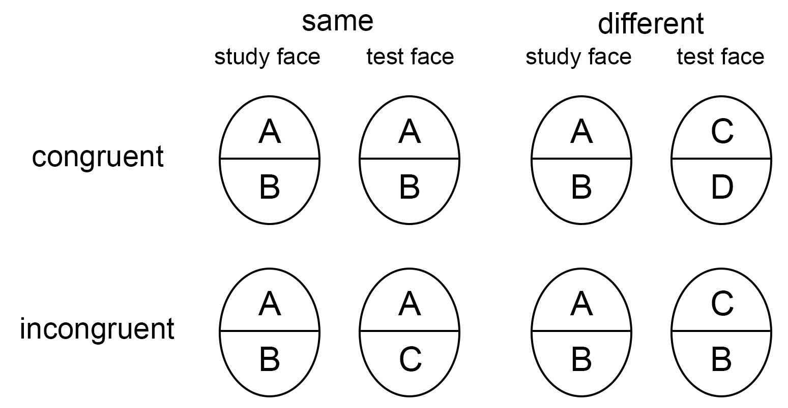

```{r setup and load the related libraries, include=FALSE}
## load libraries
library(knitr)
library(tidyverse)
library(afex)
library(emmeans)
library(lme4)
library(papaja)

options(emmeans=list(msg.interaction=FALSE))
theme_set(theme_apa())

# set global chunk options, put figures into folder
options(tinytex.verbose = TRUE)
options(warn=-1, replace.assign=TRUE)
knitr::opts_chunk$set(
  echo = FALSE,
  include = TRUE,
  # warning = FALSE,
  fig.align = "center",
  fig.path = "figures/figure-",
  fig.show = "hold",
  fig.width=7, fig.asp =0.618,
  width = 1800, 
  message = FALSE
)

source(here::here("R", "funcs.R"))

n_cores <- parallel::detectCores()
set.seed(2021)
```

# Appendix 1: a faked training study

In this faked study, two protocols are proposed to train participants' face recognition abilities. Suppose we would like to know (1) whether the first protocol is effective, (2) whether the second protocol is effective, and (3) which protocol is more effective. Two groups of participants were trained with protocol 1 and 2, respectively, and a third group completed a control task. All participants' performance in recognizing faces were measured before and after the training (or the control task). In summary, it is a 3 (Group: control, protocol 1, vs. protocol 2) × 2 (Test: pre-test vs. post-test) mixed experimental design.

Before conducting the analysis, we need to be clear about which effects should be examined for answering each question and the logic relationships among them.

1.  For the first question, both whether the performance is *better* in the post- than pre-test for the group trained with protocol 1, and whether the performance increases (i.e., post-test $-$ pre-test) are *larger* for protocol 1 than the control group should be examined. We may claim that protocol 1 is effective only when both effects are significant.
2.  For the second question, both whether the performance is *better* in the post- than pre-test for the group trained with protocol 2, and whether the performance increases (i.e., post-test $-$ pre-test) are *larger* for protocol 2 than the control group should be examined. We may claim that protocol 2 is effective only when both effects are significant.
3.  For the third question, whether the performance increases (i.e., post-test $-$ pre-test) in protocol 1 group is different from protocol 2 group should be examined. We may claim that the effectiveness of the two protocols differ if the effect is significant.

For all these effects, the convention alpha level of 5% would be used at the single test level, and, therefore, the Hypothesis-based Type I Error Rate (HER) is not higher than that (more see Appendix 3).

## Simulating data

Let's simulate a data set for above design with 30 participants for each group:

```{r message=FALSE, warning=FALSE}
Groups <- c("control", "protocol1", "protocol2") # Between-subject
Test <- c("pre_test", "post_test") # Within-subject

N_1 <- 30 # number of participant in each group

mean_pre <- 3 # mean of pre-test performance
delta <- c(0.5, 0.7, 1.3) + mean_pre # mean of post-test performance

rho <- 0.5  # correlation between pre- and post-tests
sd <- 0.5   # the same standard deviation/variances were used

C <- matrix(rho, nrow = 2, ncol = 2)
diag(C) <- 1

simu_control <- mvtnorm::rmvnorm(N_1, c(mean_pre, delta[1]), sigma = C*sd^2)
simu_protocal1 <- mvtnorm::rmvnorm(N_1, c(mean_pre, delta[2]), sigma = C*sd^2)
simu_protocal2 <- mvtnorm::rmvnorm(N_1, c(mean_pre, delta[3]), sigma = C*sd^2)

df_simu_train <- rbind(simu_control, simu_protocal1, simu_protocal2) %>% 
  as_tibble() %>% 
  transmute(Subj = 1:(N_1*3),
            Group = rep(Groups, each = N_1),
            pre = V1,
            post = V2) %>% 
  pivot_longer(c(pre, post), names_to = "Test", values_to = "d")
```
The "truth" for each conditions is:
```{r}
tibble(Test = c("pre-test", "post-test"),
       control = c(mean_pre, delta[1]),
       protocol1 = c(mean_pre, delta[2]),
       protocol2 = c(mean_pre, delta[3])) %>% 
  apa_table()
```

The structure of the simulated data is as followings:
```{r}
str(df_simu_train)
```

## Mixed ANOVA

When ANOVA is used, specific effects should be examined are:

1.  For the first question, one simple effect (i.e., the comparison between pre- and post-tests in protocol 1 group) and the simple interaction between Group (control vs. protocol 1) and Test (pre- vs. post-tests) should be examined.
2.  For the second question, one simple effect (i.e., the comparison between pre- and post-tests in protocol 2 group) and the simple interaction between Group (control vs. protocol 2) and Test (pre- vs. post-tests) should be examined.
3.  For the third question, the simple interaction between Group (protocol 1 vs. protocol 2) and Test (pre- vs. post-tests) should be examined.

Noteworthy, some of the effects are directional, and this directional information is obscured by ANOVAs. Researchers need additionally to check the means of differences to draw conclusions about the effect directions.

Three 2 $\times$ 2 ANOVAs may be employed to answer above three questions, respectively. However, one caveat is that when three 2 $\times$ 2 ANOVAs are used, even though the variances for each condition are assumed to homogeneous in each ANVOA, it does not necessarily mean that the variances of the same condition match in different ANOVAs. For instance, the variances of the control group pre-test performance in the first ANOVA may be different from that in the second ANOVA. This caveat does not mean performing three ANOVAs is wrong, but researchers should be clear about the assumptions applied in this approach. Alternatively, a typical 3 (Group: control, protocol 1, vs. protocol 2) × 2 (Test: pre-test vs. post-test) mixed-ANOVA could be performed at first and the planned effects are examined later.

The 3 (Group: control, protocol 1, vs. protocol 2) × 2 (Test: pre-test vs. post-test) mixed-ANOVA:
```{r echo=TRUE}
train_aov <- aov_4(d ~ Group * Test + (Test | Subj),
                   data = df_simu_train)
```
No results are displayed as none of these effects could help to answer above questions.

Next, we use `library(emmeans)` to obtain the two simple effects of interest for the first two questions:
```{r echo=TRUE}
train_emm <- emmeans(train_aov, ~ Test + Group)
simp1 <- contrast(train_emm, method = "revpairwise", by="Group")
simp1[2:3]
```
These results showed that the post-test performance is better than the pre-test in both training groups. Nevertheless, we could not only use these effects to draw conclusions for the first two questions.

We then conducted the simple interaction analysis:
```{r echo=TRUE}
contrast(train_emm, interaction="revpairwise")
```
With the results of both the simple effects and the simple interaction effects, we may claim that:

1.  we failed to observe the evidence that protocol 1 is effective; (note that we cannot claim that protocol 1 is not effective or protocol 1 is comparable to the control group.)
2.  protocol 2 is effective.
3.  protocol 2 is more effective than protocol 1.

## Custom contrast
Another researcher would like to know whether the average performance increases in the two training groups are higher than control group. None of the main effects, interaction, post-hoc, simple effects, or simple interaction effects could be used to answer this question. They need to apply the custom contrast:

```{r echo=TRUE}
contrast(train_emm, method = list("average training"=c(1, -1, -.5, .5, -.5, .5)))
```
Results showed that the average training performance increases are higher than the control group.

# Appendix 2: the complete composite face paradigm

One of the popular paradigms measuring holistic face processing is the complete composite face task [@Richler2014]. In this task, participants view two consecutive composite faces (made by combining top and bottom facial halves from different identities) and judge whether the two top halves are the same while ignore the bottom halves. There are mainly three independent variables in this paradigm: Congruency (*congruent* vs. *incongruent*), Alignment (*aligned* vs. *misaligned*), and SameDifferent (*same* vs. *different*). SameDifferent (*same* vs. *different*) refers to whether the two top (i.e., target) halves are the same or not (Figure \@ref(fig:ccf-design)). Alignment (*aligned* vs. *misaligned*) refers to whether the top and bottom facial halves are aligned or misaligned. Congruency (*congruent* vs. *incongruent*) refers to whether the situations of two top facial halves are the same as those of two bottom halves (Figure \@ref(fig:ccf-design)). Specifically, in *congruent* trials, when the two top facial halves are the same, the two bottom halves are also the same; when the two top facial halves are different, the bottom halves are different as well. Since in the congruent trials, the situations are the same for both the top and bottom facial halves, the bottom halves should facilitate the processing of top halves if participants could not ignore them. On the other hand, in *incongruent* trials, when the two top facial halves are different, the bottom halves are the same or vice versa. Thus, the bottom halves should interfere with the processing of top halves if participants could not ignore the bottom halves. In other words, participants are expected to perform better in the *congruent* relative to *incongruent* trials (for aligned faces), which is also known as the Congruency effect. Critically, this Congruency effect should be reduced for misaligned composite faces if the influence of bottom halves on the top halves only occurs for aligned (intact) faces. This expected result pattern, also known as the composite face effect (CFE), is displayed in Figure \@ref(fig:ccf-result). For this result pattern, we should observe a significant interaction between Congruency and Alignment if we perform a 2 (Congruency: *congruent* vs. *incongruent*) $\times$ 2 (Alignment: *aligned* vs. *misaligned*) repeated-measures ANOVA. Probably this is why this interaction is typically employed as the index of CFE [e.g., @Ross2015; @Zhao2014]. However, a significant interaction between Congruency and Alignment does not grantee the expected result pattern of CFE (see Figure X in the main text). As discussed in the main text, we also need to examine the Congruency effect in the aligned condition. In summary, we need to examine (1) whether the Congruency effect is larger than 0 in the aligned condition, and (2) whether the Congruency effect in the aligned condition is larger than that in the misaligned condition. 

(ref:ccf-design-caption) Experimental designs of the complete composite paradigm for aligned faces only. *Same* and *different* refers to whether the top facial (i.e., target) halves are the same. Congruency (*congruent* vs. *incongruent*) refers to whether the situations of two top facial halves are the same as those of two bottom halves. In *congruent* trials, when the two top halves are the same, the two bottom halves are also the same; when the two top halves are different, the bottom halves are different as well. In *incongruent* trials, when the two top halves are different, the bottom halves are the same, or vice versa.

```{r ccf-design, fig.width=5, fig.cap="(ref:ccf-design-caption)"}

```

(ref:ccf-result-caption) Expected (simulated) results of the complete composite face paradigm, i.e., the composite effect. The *same* and *different* trials are treated as "signal" and "noise" in the signal detection theory, and both of them are used to calculate sensitivity *d*' to describe the behavioral responses.

```{r ccf-result, fig.cap="(ref:ccf-result-caption)"}
tibble(Alignment = rep(c("aligned", "misaligned"), each=2),
       Congruency = rep(c("congruent", "incongruent"), 2),
       d = c(3.5, 2, 3, 2.9)) %>% 
  ggplot(aes(Alignment, d, color=Congruency, group=Congruency)) +
  geom_point(size=3, position=position_dodge(.1)) +
  geom_line(aes(linetype=Congruency), size=1) +
  ylim(c(0, 4)) +
  labs(y="Sensitivity"~italic(d)~"'") +
  theme(text = element_text(size = 18))
```

Next, a data set from one previous study [@Jin] was used to examine whether there is evidence for CFE with repeated-measures ANOVA, one-sample t-test, and linear mixed-effects models.

## Repeated-measures ANOVA

When using repeated-measures ANOVA, we need to test (1) one simple effect, i.e. the comparison between *congruent* and *incongruent* trials in the aligned condition, and (2) the interaction between *Congruency* and *Alignment*. The estimated marginal means are displayed in Figure \@ref(fig:aov-emm)

```{r include=FALSE}
# read and make the data into long format
df_cf_wide <- read_csv(here::here("data", "Jin_E1_d_wide.csv"))
df_cf_long <- df_cf_wide %>% 
  pivot_longer(contains("."),names_to=c("Congruency", "Alignment"), 
               names_sep="[.]", values_to="d")
```

A 2 (Congruency: *congruent* vs. *incongruent*) $\times$ 2 (Alignment: *aligned* vs. *misaligned*) repeated-measures ANOVA is conducted as followings:
```{r echo=T}
cf_aov <- aov_4(d ~ Congruency * Alignment + 
                  (Congruency * Alignment | Participant),
                data = df_cf_long)
cf_aov
```
We may check the results of the interaction from above ANOVA table. As the direction of the effects are obscured by ANOVAs, we need to check the difference means to obtain this information. Alternatively, the directional information could be obtained by:
```{r echo=T}
emm_aov <- emmeans(cf_aov, ~ Congruency + Alignment)
contrast(emm_aov, interaction="pairwise")
```
These results showed that the Congruency effect in the aligned condition is larger than that in the misaligned condition.

Next, we examine the simple effect according to the research question: 
```{r echo=T}
contrast(emm_aov, "pairwise", by="Alignment")[1]
```
Results of this simple effect showed that the Congruency effect is larger than 0 in the aligned condition. 

With both the significant interaction and the simple effect, we may claim that the composite effect is observed in this study. 

(ref:aov-emm-caption) Results of the composite effect analyzed with ANOVAs. (TBD)

```{r aov-emm, fig.cap="(ref:aov-emm-caption)"}
ggplot(as_tibble(emm_aov), 
       aes(Alignment, emmean, color=Congruency, group=Congruency)) +
  geom_point(size=3, position=position_dodge(.1)) +
  geom_line(aes(linetype=Congruency), size=1) +
  geom_errorbar(aes(ymin=lower.CL, ymax=upper.CL), 
                width=.15, position=position_dodge(.1)) +
  ylim(c(0, 4)) +
  labs(y="Sensitivity"~italic(d)~"'") +
  theme(text = element_text(size = 18))
```

## One-sample t-test

As we discussed earlier, CFE mainly refers to (1) the performance for congruent trials are better than incongruent trials in the aligned condition, i.e., observing the Congruency effect, and (2) the Congruency effect is stronger in the aligned relative to misaligned condition. Notably, we could test the Congruency effect in the aligned condition with the pairwise comparison between congruent_aligned and incongruent_aligned trials. In addition,

Alternatively, calculate the differences of differences (i.e., $(d'_{congruent/aligned} - d'_{incongruent/aligned}) - (d'_{congruent/misaligned} - d'_{incongruent/misaligned})$) and test it against 0 [e.g., @Chua2014a; @Wang2019].

```{r, echo=T}
df_cf_d <- df_cf_wide %>% 
  mutate(d_cf = (congruent.aligned-incongruent.aligned)-
           (congruent.misaligned-incongruent.misaligned)) 

t.test(df_cf_d$d_cf)
```

```{r}
t.test(df_cf_d$d_cf, alternative="greater")
```

```{r}
t.test(df_cf_d$congruent.aligned, df_cf_d$congruent.misaligned, 
       paired = TRUE,
       alternative="greater")
```

## Linear mixed-effects models

In linear mixed-effects models (LMM), we need to examine (1) whether there is Congruency effect in the aligned condition (i.e., whether the performance on congruent trials is better than that on incongruent trials in the aligned condition), and (2) whether the Congruency effect in the aligned condition is larger than that in the misaligned condition. 

For simplicity, condition means for each participant and the intercept-only model are used in this analysis. Typically it is more beneficial to conduct LMM with full random-effects structure on the trial-level data. Anyhow, these choices would not invalidate our demonstration. 

```{r, echo=T}
cf_lmm <- lmer(d ~ Congruency * Alignment + (1 | Participant),
               data = df_cf_long)
round(summary(cf_lmm)$coefficients, 3)  # only show results of fixed effects
```
With the default dummy coding in R, `Congruencyincongruent` examines how much the performance on aligned incongruent trails is larger than that on aligned congruent trials, which is significantly smaller than 0. `Congruencyincongruent:Alignmentmisaligned` examines the how much the Congruency effect in the aligned condition is larger than that in the misaligned condition, which is significantly larger than 0. In other words, the Congruency effect in the aligned condition is larger than 0 and it is also larger than that in the misaligned condition. With this evidence, we may claim that the composite effect is observed in this study. Note that since our predictions are directional, we may use one-sided, instead of two-sided, tests. For instance, we may use t-value of 1.65 instead of 1.96 as the threshold to claim the significant effect. 

Try one-sided test:
```{r}
emm_lmm <- emmeans(cf_lmm, ~ Congruency + Alignment)
summary(contrast(emm_lmm, method="pairwise", by="Alignment"), side=">") 
```

```{r}
summary(contrast(emm_lmm, interaction="pairwise"), side=">") 
```

# Appendix 3: simulation for calculating Hypothesis-based Type I Error Rate 

For each iteration, null effects are used to simulate data for a 2 (Congruency: *congruent* vs. *incongruent*) $\times$ 2 (Alignment: *aligned* vs. *misaligned*) within-subjects design, where the population means for all four individual conditions are the same. Then the p-value of the comparison between *aligned congruent* and *aligned incongruent* conditions and the p-value for the interaction are calculated and recorded. This process is repeated 5000 times for each of the ten sample sizes (varied from 10 to 1000). After simulating the data, different $\alpha$ levels for single tests were applied to each iteration. The Single Test Type I Error Rate (STER) for the simple effect and the interaction, as well as the HER where both the simple effect and interaction are significant, were caculated. Results are displayed in Figure \@ref(fig:simu-her)

```{r}
Ns <- c(10, 30, 50, 75, 100, 150, 200, 300, 500, 1000)
# function for simulation is saved in R/funcs.R
# you may want to use less cores and this simulation may take several hours
simu_within <- simu_null(iter=5000, N=Ns, n_core = 18,
                         file_cache = here::here("simulation", "simu_within.rds"))
# simu_alpha(simu_within)
```

(ref:simu-her-caption) Type I error rates at both single test and hypothesis-based levels when different $\alpha$ is applied to single tests. The dashed lines denote the Single Test Type I Error Rate (STER) for the interaction and simple effect, respectively. The solid line denotes the Hypothesis-based Type I Error Rate (HER) for claiming the composite effect, i.e., both the interaction and simple effect are significant. The gray dashed and solid lines denote STER and HER for simulated data with different sample sizes (varying from 10 to 1000) and black lines are the means of these error rates. Error rates are similar for data with varied sample sizes. STER for the interaction and simple effect matched the corresponding $\alpha$, while HER is about half of the $\alpha$. For instance, when alpha of 0.1 is applied to single tests as indicated by the vertical dashed line, HER is just below 0.05, an conventionally acceptable threshold as indicated by the horizontal dashed line.   

```{r simu-her, fig.asp=.75, fig.cap="(ref:simu-her-caption)"}
# alpha_ls <- c(.5, .4, .3, .2, .1, .05, .01, .001, .0001)
alpha_ls <- c(.3, .2, .15, .1, .05, .01, .001, .0001)
df_alpha <- map_dfr(alpha_ls, simu_alpha, 
               df_simu=simu_within, disp=F, .id="alpha_int") %>% 
  mutate(alpha=alpha_ls[as.integer(alpha_int)]) 

df_alpha_mean <- df_alpha %>% 
  group_by(effects, alpha) %>% 
  select(effects, alpha, Type_I) %>% 
  summarize(Type_I_mean = mean(Type_I), .groups = "keep")
  
df_alpha %>% 
  ggplot(aes(alpha, Type_I, linetype=effects)) +
  geom_point(alpha=.5) +
  geom_line(aes(group=interaction(N, effects, sep = "-")), alpha=.2, show.legend=F) +
  geom_line(data=df_alpha_mean, aes(y=Type_I_mean), size=1) +
  geom_hline(yintercept = .05, linetype="dashed") +
  geom_vline(xintercept = .1, linetype="dashed") +
  scale_linetype_discrete(labels=c("HER", "STER: interaction", "STER: simple effect")) +
  scale_y_continuous(breaks=seq(0,.3,.05)) +
  scale_x_continuous(breaks=seq(0,.3,.05)) +
  labs(x=expression(alpha~"level for a single test"),
       y="Type I error rate") +
  theme(legend.title = element_blank(),
        legend.position = c(0.85, 0.155)) +
  NULL

```

```{r}
# function for simulation is saved in R/funcs.R
# you may want to use less cores and this simulation may take hours
simu_between <- simu_null(iter=5000, N=Ns, rho=0, n_core = 18,
                          file_cache = here::here("simulation", "simu_between.rds"))
# simu_alpha(simu_between)
```


```{r fig.asp=.75}
# alpha_ls <- c(.5, .4, .3, .2, .1, .05, .01, .001, .0001)
alpha_ls <- c(.3, .2, .15, .1, .05, .01, .001, .0001)
df_alpha_b <- map_dfr(alpha_ls, simu_alpha, 
               df_simu=simu_between, disp=F, .id="alpha_int") %>% 
  mutate(alpha=alpha_ls[as.integer(alpha_int)]) 

df_alpha_b_mean <- df_alpha_b %>% 
  group_by(effects, alpha) %>% 
  select(effects, alpha, Type_I) %>% 
  summarize(Type_I_mean = mean(Type_I), .groups = "keep")
  
df_alpha_b %>% 
  ggplot(aes(alpha, Type_I, linetype=effects)) +
  geom_point(alpha=.5) +
  geom_line(aes(group=interaction(N, effects, sep = "-")), alpha=.2, show.legend=F) +
  geom_line(data=df_alpha_b_mean, aes(y=Type_I_mean), size=1) +
  geom_hline(yintercept = .05, linetype="dashed") +
  geom_vline(xintercept = .1, linetype="dashed") +
  scale_linetype_discrete(labels=c("HER", "STER: interaction", "STER: simple effect")) +
  labs(x=expression(alpha~"level for a single test"),
       y="Type I error rate") +
  theme(legend.title = element_blank(),
        legend.position = c(0.85, 0.17),
        legend.margin=margin(0, 20, 20, 10)) +
  NULL

```

# Reference {.unnumbered}

```{r create_r-references, echo=F, cache = FALSE}
papaja::r_refs(file = "r-references.bib")
```
